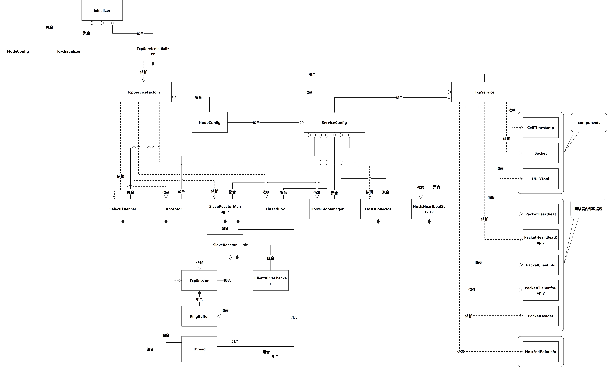

# 网络模块关键点解析

网络模块为服务端/客户端一体，服务端和客户端共享已连接节点信息（nodeId等），假设A节点已经与B节点建立连接，B再连接A时，A发现本节点已经存在与B的连接，会拒绝B发起的连接，可以达到A节点与B节点互联共享一条连接的目的。

## 网络服务端关键点解析

1. 监听套接字连接队列设置为500。

2. 采用reactor模式编写。

3. 主reactor中只需要监测监听套接字是否有连接上来，感觉监听套接字设置为非阻塞没太大意义，故采用select模型(Selector)检测监听套接字是否有连接上线。

4. 检测到有连接上线后，通知Acceptor，Acceptor有自己的独立线程，负责accept到客户端的连接套接字，然后创建会话(TcpSession)，客户端的连接套接字（文档后续部分介绍直接使用fd或者TcpSession指代某个客户端）会包含在TcpSession中，最后将TcpSession抛给SlaveReactorManager。

5. SlaveReactorManager有一个SPSC的无锁队列，Acceptor抛过来的TcpSession会放入队列中，由SlaveReactorManager在自己的线程中将TcpSession按照一定的策略分配到自己管理的多个SlaveReactor中。

6. 关于SlaveReactorManager的负载均衡策略是每派发50个TcpSession到SlaveReactor后，检测一次哪个SlaveReactor管理的TcpSession最少（假设这里管理TcpSession最少的SlaveReactor为minTcpSessionSlaveReactor），那么接下来的50个TcpSession将会分配到minTcpSessionSlaveReactor，又因为随时都可能有客户端离线，所以各个SlaveReactor管理的TcpSession并不是相同的，也不是严格相差50个。

7. SlaveReactor中采用epoll边缘触发模式管理fd。

8. 用来收发客户端数据的环形缓冲区包含在TcpSession中，环形缓冲区的实现是libcomponents中的RingBuffer.h/.cpp。

9. 客户端每次会收取环形缓冲区中的最大连续空间大小，比如缓冲区大小是128字节，startOffset是30，endOffset是90，也就是30到90之间是有效数据，那么本次recv的数据大小（即recv的第三个参数）是128-90=38个字节。所以数据接收策略并不是一次收取尽可能多的数据。

10. 如果一次收取的数据过多，比如一次接收的数据里面包含几十万个包，又因为一个SlaveReactor可能管理多个客户端，如果一次性将一个客户端的包都解完再解下一个客户端的包，会导致不能及时处理并响应别的客户端的请求，所以限制一个客户端每次解包100个，没解完的包下个循环再处理。

11. 解包的时候仅解析包头(PacketHeader)，然后从PacketHeader中获取payloadLength，将packetHeader和payloadData（存在数据拷贝）回调出来，然后将环形缓冲区的startOffset向后偏移，大体逻辑是：

    ```c++
    startOffset = (startOffset + (headerLength + payloadLength)) % m_buffer.size();
    ```

12. 回调函数根据包里面的moduleId将包派发给各个模组进行处理。

13. 回调函数会放入ThreadPool中，ThreadPool存在于TcpService，对业务层是无感的。

14. ThreadPool里面是一个MPMC的无锁队列。

15. 对于ClientInfo，ClientInfoReply，Heartbeat，HeartbeatReply等网络层内部握手协议包，是立即在网络层内部处理的，不会到ThreadPool线程池中处理。

## 网络客户端关键点解析

1. 客户端连接上服务端后，同样创建一个TcpSession代表对端，TcpSession也是交给SlaveReactorManager并派发给SlaveReactor处理。

2. 客户端有两个主要类：HostsConnector，HostsInfoManager。HostsInfosConnector不存储节点信息，向HostsInfoManager获取节点信息，使用非阻塞套接字及Select模型进行异步连接。

3. HostsInfoManager有两个主要数据结构：

   ```c++
   std::unordered_map<HostEndPointInfo, std::pair<std::string, std::uint64_t>, HostEndPointInfo::hashFunction> m_hosts;
   ```

   HostsEndPointInfo是对端节点的ip, port二元组信息，当连接上对端节点的时候，将对端节点的nodeId信息填充到m_hosts[hostEndPointInfo].first中，HostsConnector会认为对端节点已经连接上，不会再尝试连接此节点。对端节点离线时，m_hosts[hostEndPointInfo].first被清空，HostsConnector再次尝试连接。

   ```c++
   // NodeId => (fd, handshakeUuid)
   std::unordered_map<std::string, std::pair<int, std::string>> m_nodeIdInfos;
   ```

该数据结构存储节点NodeId和对应到该节点的fd，用来发送数据时根据nodeId找到fd，至于handshakeUuid，请参考文档2（节点ID互相连接共享一条连接的协议文档）

## UML Class

