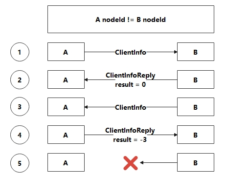
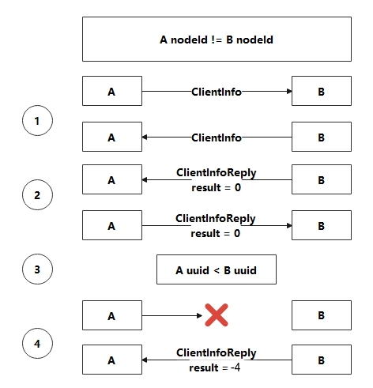
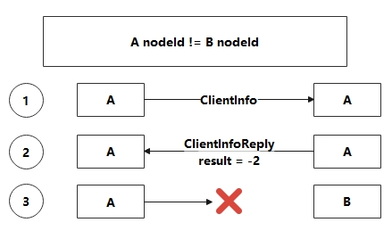
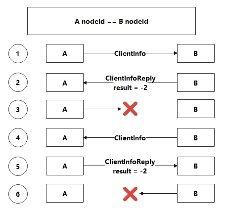

### 关于处理重复连接的握手协议介绍：

握手包有两个：ClientInfo和ClientInfoReply

```protobuf
message ClientInfo
{
    uint32 seq = 1;
    string localHost = 2;	//　本机的监听IP和端口
    string peerHost = 3;	//　要连接的IP和端口
    string handshakeUuid = 4;	// 代表连接的uuid
    string nodeId = 5;
}
```

```protobuf
message ClientInfoReply
{
	uint32 seq = 1;
	string peerHost = 2;	// 和ClientInfo中的peerHost值一样，目的是为了让连接方知道这个Reply包是谁发回来的
	string handshakeUuid = 3;
	string nodeId = 4;
	int32 result = 5;	// 0代表无错误，-1代表通用错误，-2代表连接自己，-3代表连接已经存在
}
```

客户端连接由两个类负责：HostsConnector，HostsInfoManager

HostsConnector主要从HostsInfoManager中获取其他节点信息（可能包括自身节点，所以要处理自己连接自己的情况）后进行连接（创建套接字，使用select监测连接状态）

HostsInfoManager中有两个数据结构存储节点信息和连接状况：

1. HostEndPointInfo(ip port二元组) => (nodeId, timestamp)

```c++
std::unordered_map<HostEndPointInfo, std::pair<std::string, std::uint64_t>, HostEndPointInfo::hashFunction> m_hosts;
```

当节点成功连接的时候，nodeId会被设置，HostsConnector就不会再尝试连接这个节点

2. nodeId => (fd, handshakeUuid)

```c++
std::unordered_map<std::string, std::pair<int, std::string>> m_nodeIdInfos;
```

#### 第一种连接情况



首先以一个简单的情况说明连接流程（后面再讨论较为复杂的情况）：

(1) 假设A节点的监听地址和端口为127.0.0.1:9998，B节点的监听地址和端口为127.0.0.1:9999

(2) A节点socket connect B节点成功后，A发送ClientInfo给B，ClientInfo的peerHost被设置为"127.0.0.1:9999"，nodeId设置为A节点的id

(3) B收到A发来的ClientInfo后，将A节点的nodeId和accept到的fd存到m_nodeIdInfos中，然后创建ClientInfoReply包，将ClientInfoReply中的peerHost设置为ClientInfo中peerHost的值，即"127.0.0.1:9999"，将nodeId设置为自身的节点Id

(4) A收到B发回来的ClientInfoReply，执行以下语句:

```c++
std::string host = clientInfoReply.peerHost();
m_hosts[host].first = clientInfoReply.nodeId();
```

(5) 此时m_hosts["127.0.0.1:9999"].first.empty()为false，HostsConnector会认为B节点已经连接上，不会在创建socket继续尝试连接

(6) A已经知道B连上了，但是B的节点列表可能也有A，B socket connect A成功后向A发送ClientInfo包，ClientInfo包中携带的信息前面的步骤已经介绍

(7) A收到B发来的ClientInfo包，检测到B的nodeId已经存在于m_nodeIdInfos，认为A与B之间已经存在一条连接，A此时不操作m_nodeIdInfos和m_hosts数据结构，创建ClientInfoReply包，将result设置为-3，意思是重复连接，发回给B

(8) B收到A发回来的ClientInfoReply包，将A的nodeId写入到m_hosts["127.0.0.1:9998"].first中，这样B知道A已经连上，又检测到result为-3，SlaveReactor会断开连接，结果相当于是告诉连接发起者主动断开重复连接，即A先与B建立了一条连接，B再尝试与A建立连接的时候，A告诉B我跟你已经有一条连接了，B就断开连接

(9) B断开连接，A中会检测到B的连接套接字错误（对端断开），A也会关闭B的连接套接字，但是检测到对端连接套接字错误也可能是因为对端宕机，如果是对端宕机则需要将B的nodeId从m_nodeIdInfos中移除，并且执行m_hosts["127.0.0.1:9999"].first.clear()，这样B就处于未连接状态，重新尝试连接，如何区分是B因为重复连接还是宕机而断开连接呢，如果A关闭B的重复连接时将B的nodeId从m_nodeIdInfos中移除了话，就丢失了本该存在的连接，这时前面一直没有提到的uuid就登场了

(10) A连接B的时候ClientInfo会带上一个uuid，B回应A的ClientInfoReply中也会带上相同的uuid，所以A中代表B的TcpSession和B中代表A的TcpSession具有相同的uuid，如果B主动断开重复的第二条连接，第二条连接与已经存在的连接的uuid是不同的，只有nodeId和uuid都相同才能将key为nodeId的键值对从m_nodeIdInfos中移除，这样就不会再重复连接时将本该存在的第一条连接断开。

#### 第二种连接情况



上面介绍的例子是A连接B，A发送给B ClientInfo包后，B回应给A ClientInfoReply包，第一条连接建立完成后，B再尝试连接A，但实际情况有可能是A和B同时连接对方，会出现A和B同时向对方发送了ClientInfo后，A才收到B的ClientInfoReply包，下面介绍这种情况的处理(由于上面已经较为详细的介绍了正常连接流程，下面近介绍关键不同点)：

(1) A和B都已收到对方发来的ClientInfo包

(2) 此时A收到B发回来的ClientInfoReply包，A收到B的ClientInfo时就会回应ClientInfoReply包给B，所以这种时候其实两条连接都已经成功建立（这里是指ClientInfoReply对方已收到并且result为0），那么就在收到对方ClientInfoReply的时候，比对两条连接的uuid大小，断开较小uuid的那条连接

(3) 在极小概率情况下，A连接B的uuid与B连接A的uuid相同，此时双方都向存储于m_nodeIdInfos中的fd发送result为-1的ClientInfoReply包，告诉对方断开连接并将id信息从m_nodeIdInfos中移除和将host设置为未连接状态，即uuid相同的时候，双方连接断开，重新发起连接

#### 第三种连接情况



自己连自己：A节点配置文件的节点列表可能包含自身，即假设A的监听IP和端口为：127.0.0.1:9998，但配置文件中的节点列表包含127.0.0.1:9998，这时需要处理自己连自己的问题

(1) A节点收到ClientInfo包，检测到ClientInfo包中的nodeId和自身nodeId相同，创建ClientInfoReply包并设置result为-2（代表connect self）

(2) A节点的客户端收到ClientInfoReply后，检测到result为-2，主动断开连接

(3) A节点的服务端检测到对端断开连接，同样要区分是因为客户端是因为Connect Self/Duplicate Connection等原因主动断开，还是说客户端掉线了，前面也说过，掉线和对方主动断开的处理有可能是不同的，如Hosts连接状态，m_nodeIdInfos数据处理等都会不同。这里的处理方式是：A的服务端断开连接的时候检测该条连接(TcpSession)中的nodeId(即代表对端会话的Session中存储的对端ID)是否等于自身nodeId，如果相等，就依旧保持Hosts为连接状态，即A与A是连接状态(但实际上A与A之间不存在Tcp连接)，这里只是保留了连接标志，A就不会再尝试连接A，而A客户端发送ClientInfo包给A服务端的时候，检测到nodeId相同就直接发回ClientInfoReply包，所以m_nodeIdInfos中也不会有多余的信息

#### 第四种连接情况



A连接B，但是可能A和B节点的配置文件中的nodeId存在错误，A节点的nodeId和B节点的nodeId相同了

这种情况也是经历两次连接断开后，A与B之间最终不存在连接

(1) A连接B，被B发送result为-2的ClientInfoReply包，A主动断开连接，移除m_nodeIdInfos中的id信息，Hosts信息不动，这样A不会再次尝试连接B

(2) B连接A，被A发送result为-2的ClientInfoReply包，B主动断开连接，移除m_nodeIdInfos中的id信息，Hosts信息不动，这样B不会再次尝试连接A