<H1 align="center">CPU占用分析</H1>

进程启动后top

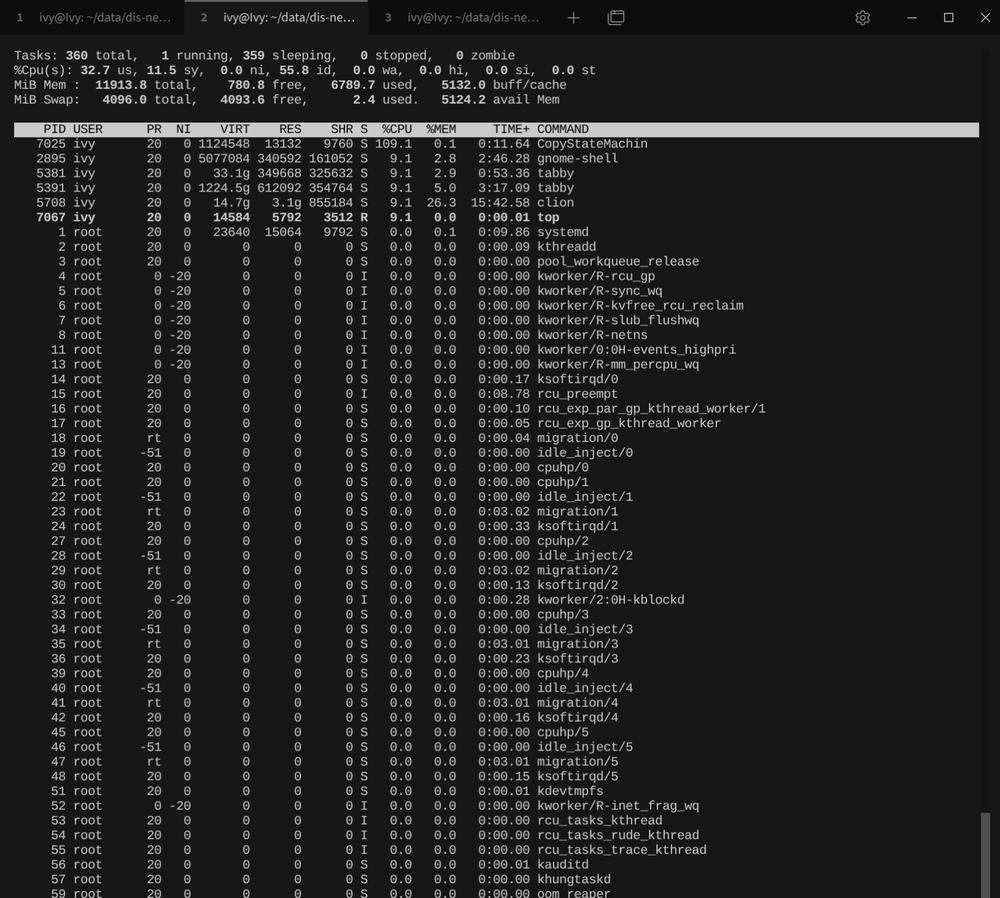

按下H

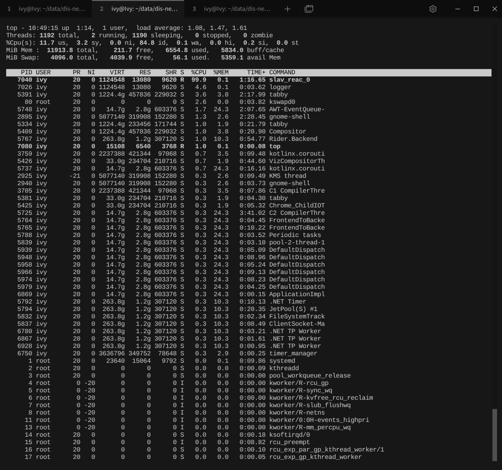

查看属于该进程的所有进程

top -H -p 4135

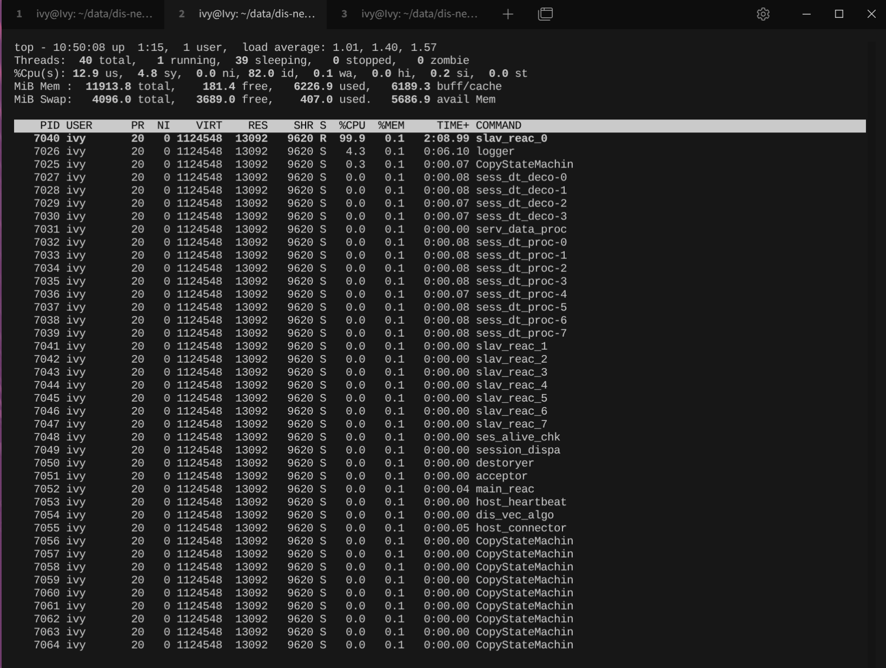

使用gdb -p <pid> attach到进程

```shell
$ sudo gdb -p 7025
GNU gdb (Ubuntu 15.1-1ubuntu1~24.04.1) 15.1
Copyright (C) 2024 Free Software Foundation, Inc.
License GPLv3+: GNU GPL version 3 or later <http://gnu.org/licenses/gpl.html>
This is free software: you are free to change and redistribute it.
There is NO WARRANTY, to the extent permitted by law.
Type "show copying" and "show warranty" for details.
This GDB was configured as "x86_64-linux-gnu".
Type "show configuration" for configuration details.
For bug reporting instructions, please see:
<https://www.gnu.org/software/gdb/bugs/>.
Find the GDB manual and other documentation resources online at:
    <http://www.gnu.org/software/gdb/documentation/>.

For help, type "help".
Type "apropos word" to search for commands related to "word".
Attaching to process 7025
[New LWP 7064]
[New LWP 7063]
[New LWP 7062]
[New LWP 7061]
[New LWP 7060]
[New LWP 7059]
[New LWP 7058]
[New LWP 7057]
[New LWP 7056]
[New LWP 7055]
[New LWP 7054]
[New LWP 7053]
[New LWP 7052]
[New LWP 7051]
[New LWP 7050]
[New LWP 7049]
[New LWP 7048]
[New LWP 7047]
[New LWP 7046]
[New LWP 7045]
[New LWP 7044]
[New LWP 7043]
[New LWP 7042]
[New LWP 7041]
[New LWP 7040]
[New LWP 7039]
[New LWP 7038]
[New LWP 7037]
[New LWP 7036]
[New LWP 7035]
[New LWP 7034]
[New LWP 7033]
[New LWP 7032]
[New LWP 7031]
[New LWP 7030]
[New LWP 7029]
[New LWP 7028]
[New LWP 7027]
[New LWP 7026]
[Thread debugging using libthread_db enabled]
Using host libthread_db library "/lib/x86_64-linux-gnu/libthread_db.so.1".
0x00007ffb764ecadf in __GI___clock_nanosleep (clock_id=clock_id@entry=0, flags=flags@entry=0, req=0x7ffc6e49e5e0, 
    rem=0x7ffc6e49e5e0) at ../sysdeps/unix/sysv/linux/clock_nanosleep.c:78

warning: 78     ../sysdeps/unix/sysv/linux/clock_nanosleep.c: No such file or directory
(gdb) info threads
  Id   Target Id                                          Frame 
* 1    Thread 0x7ffb76714c80 (LWP 7025) "CopyStateMachin" 0x00007ffb764ecadf in __GI___clock_nanosleep (
    clock_id=clock_id@entry=0, flags=flags@entry=0, req=0x7ffc6e49e5e0, rem=0x7ffc6e49e5e0)
    at ../sysdeps/unix/sysv/linux/clock_nanosleep.c:78
  2    Thread 0x7ffb527fc6c0 (LWP 7064) "CopyStateMachin" 0x00007ffb76498d71 in __futex_abstimed_wait_common64 (private=0, 
    cancel=true, abstime=0x0, op=393, expected=0, futex_word=0x7ffb4c000c30) at ./nptl/futex-internal.c:57
  3    Thread 0x7ffb52ffd6c0 (LWP 7063) "CopyStateMachin" 0x00007ffb76498d71 in __futex_abstimed_wait_common64 (private=0, 
    cancel=true, abstime=0x0, op=393, expected=0, futex_word=0x7ffb4c000c30) at ./nptl/futex-internal.c:57
  4    Thread 0x7ffb537fe6c0 (LWP 7062) "CopyStateMachin" 0x00007ffb76498d71 in __futex_abstimed_wait_common64 (private=0, 
    cancel=true, abstime=0x0, op=393, expected=0, futex_word=0x7ffb4c000c30) at ./nptl/futex-internal.c:57
  5    Thread 0x7ffb53fff6c0 (LWP 7061) "CopyStateMachin" 0x00007ffb76498d71 in __futex_abstimed_wait_common64 (private=0, 
    cancel=true, abstime=0x0, op=393, expected=0, futex_word=0x7ffb4c000c30) at ./nptl/futex-internal.c:57
  6    Thread 0x7ffb60ace6c0 (LWP 7060) "CopyStateMachin" 0x00007ffb76498d71 in __futex_abstimed_wait_common64 (private=0, 
    cancel=true, abstime=0x0, op=393, expected=0, futex_word=0x7ffb4c000c30) at ./nptl/futex-internal.c:57
  7    Thread 0x7ffb612cf6c0 (LWP 7059) "CopyStateMachin" 0x00007ffb76498d71 in __futex_abstimed_wait_common64 (private=0, 
    cancel=true, abstime=0x0, op=393, expected=0, futex_word=0x7ffb4c000c30) at ./nptl/futex-internal.c:57
  8    Thread 0x7ffb61ad06c0 (LWP 7058) "CopyStateMachin" 0x00007ffb76498d71 in __futex_abstimed_wait_common64 (private=0, 
    cancel=true, abstime=0x0, op=393, expected=0, futex_word=0x7ffb4c000c30) at ./nptl/futex-internal.c:57
  9    Thread 0x7ffb622d16c0 (LWP 7057) "CopyStateMachin" 0x00007ffb76498d71 in __futex_abstimed_wait_common64 (private=0, 
    cancel=true, abstime=0x0, op=393, expected=0, futex_word=0x7ffb4c000c30) at ./nptl/futex-internal.c:57
  10   Thread 0x7ffb62ad26c0 (LWP 7056) "CopyStateMachin" 0x00007ffb7652b914 in accept4 (fd=23, addr=..., addr_len=0x0, 
    flags=524288) at ../sysdeps/unix/sysv/linux/accept4.c:31
  11   Thread 0x7ffb632d36c0 (LWP 7055) "host_connector"  0x00007ffb76498d71 in __futex_abstimed_wait_common64 (private=3, 
    cancel=true, abstime=0x7ffb632d1780, op=137, expected=0, futex_word=0x6059862fe7b8) at ./nptl/futex-internal.c:57
  12   Thread 0x7ffb63ad46c0 (LWP 7054) "dis_vec_algo"    0x00007ffb76498d71 in __futex_abstimed_wait_common64 (private=11, 
    cancel=true, abstime=0x7ffb63ad2780, op=137, expected=0, futex_word=0x6059862ad978) at ./nptl/futex-internal.c:57
  13   Thread 0x7ffb642d56c0 (LWP 7053) "host_heartbeat"  0x00007ffb76498d71 in __futex_abstimed_wait_common64 (
    private=1680684512, cancel=true, abstime=0x7ffb642d3780, op=137, expected=0, futex_word=0x6059862fe8a8)
    at ./nptl/futex-internal.c:57
  14   Thread 0x7ffb64ad66c0 (LWP 7052) "main_reac"       0x00007ffb76526d07 in __GI___select (nfds=22, readfds=0x7ffb64ad46d0, 
    writefds=0x0, exceptfds=0x0, timeout=0x7ffb64ad46c0) at ../sysdeps/unix/sysv/linux/select.c:69
  15   Thread 0x7ffb652d76c0 (LWP 7051) "acceptor"        0x00007ffb76498d71 in __futex_abstimed_wait_common64 (private=32763, 
    cancel=true, abstime=0x0, op=393, expected=0, futex_word=0x6059862af670) at ./nptl/futex-internal.c:57
  16   Thread 0x7ffb65ad86c0 (LWP 7050) "destoryer"       0x00007ffb76498d71 in __futex_abstimed_wait_common64 (private=32763, 
    cancel=true, abstime=0x0, op=393, expected=0, futex_word=0x6059862b0eb4) at ./nptl/futex-internal.c:57
  17   Thread 0x7ffb662d96c0 (LWP 7049) "session_dispa"   0x00007ffb76498d71 in __futex_abstimed_wait_common64 (
    private=<optimized out>, cancel=true, abstime=0x0, op=393, expected=0, futex_word=0x6059862abb38)
    at ./nptl/futex-internal.c:57
  18   Thread 0x7ffb66ada6c0 (LWP 7048) "ses_alive_chk"   0x00007ffb76498d71 in __futex_abstimed_wait_common64 (private=0, 
    cancel=true, abstime=0x7ffb66ad8780, op=137, expected=0, futex_word=0x6059862fda08) at ./nptl/futex-internal.c:57
  19   Thread 0x7ffb672db6c0 (LWP 7047) "slav_reac_7"     0x00007ffb7652a072 in epoll_wait (epfd=18, events=0x7ffb672d7fd0, 
    maxevents=500, timeout=-1) at ../sysdeps/unix/sysv/linux/epoll_wait.c:30
  20   Thread 0x7ffb67adc6c0 (LWP 7046) "slav_reac_6"     0x00007ffb7652a072 in epoll_wait (epfd=16, events=0x7ffb67ad8fd0, 
    maxevents=500, timeout=-1) at ../sysdeps/unix/sysv/linux/epoll_wait.c:30
  21   Thread 0x7ffb682dd6c0 (LWP 7045) "slav_reac_5"     0x00007ffb7652a072 in epoll_wait (epfd=14, events=0x7ffb682d9fd0, 
    maxevents=500, timeout=-1) at ../sysdeps/unix/sysv/linux/epoll_wait.c:30
  22   Thread 0x7ffb68ade6c0 (LWP 7044) "slav_reac_4"     0x00007ffb7652a072 in epoll_wait (epfd=12, events=0x7ffb68adafd0, 
    maxevents=500, timeout=-1) at ../sysdeps/unix/sysv/linux/epoll_wait.c:30
  23   Thread 0x7ffb692df6c0 (LWP 7043) "slav_reac_3"     0x00007ffb7652a072 in epoll_wait (epfd=10, events=0x7ffb692dbfd0, 
    maxevents=500, timeout=-1) at ../sysdeps/unix/sysv/linux/epoll_wait.c:30
  24   Thread 0x7ffb69ae06c0 (LWP 7042) "slav_reac_2"     0x00007ffb7652a072 in epoll_wait (epfd=8, events=0x7ffb69adcfd0, 
    maxevents=500, timeout=-1) at ../sysdeps/unix/sysv/linux/epoll_wait.c:30
  25   Thread 0x7ffb6a2e16c0 (LWP 7041) "slav_reac_1"     0x00007ffb7652a072 in epoll_wait (epfd=6, events=0x7ffb6a2ddfd0, 
    maxevents=500, timeout=-1) at ../sysdeps/unix/sysv/linux/epoll_wait.c:30
  26   Thread 0x7ffb6aae26c0 (LWP 7040) "slav_reac_0"     0x00007ffb7652a072 in epoll_wait (epfd=4, events=0x7ffb6aadefd0, 
    maxevents=500, timeout=-1) at ../sysdeps/unix/sysv/linux/epoll_wait.c:30
  27   Thread 0x7ffb6b2e36c0 (LWP 7039) "sess_dt_proc-7"  0x00007ffb76498d71 in __futex_abstimed_wait_common64 (
    private=<optimized out>, cancel=true, abstime=0x7ffb6b2e16e0, op=137, expected=0, futex_word=0x6059862acd78)
--Type <RET> for more, q to quit, c to continue without paging--
    at ./nptl/futex-internal.c:57
  28   Thread 0x7ffb6bae46c0 (LWP 7038) "sess_dt_proc-6"  0x00007ffb76498d71 in __futex_abstimed_wait_common64 (
    private=<optimized out>, cancel=true, abstime=0x7ffb6bae26e0, op=137, expected=0, futex_word=0x6059862acd78)
    at ./nptl/futex-internal.c:57
  29   Thread 0x7ffb6c2e56c0 (LWP 7037) "sess_dt_proc-5"  0x00007ffb76498d71 in __futex_abstimed_wait_common64 (
    private=<optimized out>, cancel=true, abstime=0x7ffb6c2e36e0, op=137, expected=0, futex_word=0x6059862acd78)
    at ./nptl/futex-internal.c:57
  30   Thread 0x7ffb6cae66c0 (LWP 7036) "sess_dt_proc-4"  0x00007ffb76498d71 in __futex_abstimed_wait_common64 (
    private=<optimized out>, cancel=true, abstime=0x7ffb6cae46e0, op=137, expected=0, futex_word=0x6059862acd78)
    at ./nptl/futex-internal.c:57
  31   Thread 0x7ffb6d2e76c0 (LWP 7035) "sess_dt_proc-3"  0x00007ffb76498d71 in __futex_abstimed_wait_common64 (
    private=<optimized out>, cancel=true, abstime=0x7ffb6d2e56e0, op=137, expected=0, futex_word=0x6059862acd78)
    at ./nptl/futex-internal.c:57
  32   Thread 0x7ffb6dae86c0 (LWP 7034) "sess_dt_proc-2"  0x00007ffb76498d71 in __futex_abstimed_wait_common64 (
    private=<optimized out>, cancel=true, abstime=0x7ffb6dae66e0, op=137, expected=0, futex_word=0x6059862acd78)
    at ./nptl/futex-internal.c:57
  33   Thread 0x7ffb6e2e96c0 (LWP 7033) "sess_dt_proc-1"  0x00007ffb76498d71 in __futex_abstimed_wait_common64 (
    private=<optimized out>, cancel=true, abstime=0x7ffb6e2e76e0, op=137, expected=0, futex_word=0x6059862acd78)
    at ./nptl/futex-internal.c:57
  34   Thread 0x7ffb6eaea6c0 (LWP 7032) "sess_dt_proc-0"  0x00007ffb76498d71 in __futex_abstimed_wait_common64 (
    private=<optimized out>, cancel=true, abstime=0x7ffb6eae86e0, op=137, expected=0, futex_word=0x6059862acd78)
    at ./nptl/futex-internal.c:57
  35   Thread 0x7ffb6f2eb6c0 (LWP 7031) "serv_data_proc"  0x00007ffb76498d71 in __futex_abstimed_wait_common64 (
    private=<optimized out>, cancel=true, abstime=0x0, op=393, expected=0, futex_word=0x6059862abd48)
    at ./nptl/futex-internal.c:57
  36   Thread 0x7ffb6faec6c0 (LWP 7030) "sess_dt_deco-3"  0x00007ffb76498d71 in __futex_abstimed_wait_common64 (
    private=<optimized out>, cancel=true, abstime=0x7ffb6faea6e0, op=137, expected=0, futex_word=0x6059862accf8)
    at ./nptl/futex-internal.c:57
  37   Thread 0x7ffb752ed6c0 (LWP 7029) "sess_dt_deco-2"  0x00007ffb76498d71 in __futex_abstimed_wait_common64 (
    private=<optimized out>, cancel=true, abstime=0x7ffb752eb6e0, op=137, expected=0, futex_word=0x6059862accf8)
    at ./nptl/futex-internal.c:57
  38   Thread 0x7ffb75aee6c0 (LWP 7028) "sess_dt_deco-1"  0x00007ffb76498d71 in __futex_abstimed_wait_common64 (
    private=<optimized out>, cancel=true, abstime=0x7ffb75aec6e0, op=137, expected=0, futex_word=0x6059862accf8)
    at ./nptl/futex-internal.c:57
  39   Thread 0x7ffb762ef6c0 (LWP 7027) "sess_dt_deco-0"  0x00007ffb76498d71 in __futex_abstimed_wait_common64 (
    private=<optimized out>, cancel=true, abstime=0x7ffb762ed6e0, op=137, expected=0, futex_word=0x6059862accf8)
    at ./nptl/futex-internal.c:57
  40   Thread 0x7ffb742ee6c0 (LWP 7026) "logger"          0x00007ffb765298cb in __GI___writev (iovcnt=2, iov=0x7ffb742ec620, fd=3)
    at ../sysdeps/unix/sysv/linux/writev.c:26
```

slav_reac_0是线程26

执行

```shell
thread 26
```

切换到26号线程

```shell
(gdb) thread 26
[Switching to thread 26 (Thread 0x7ffb6aae26c0 (LWP 7040))]
#0  0x00007ffb7652a072 in epoll_wait (epfd=4, events=0x7ffb6aadefd0, maxevents=500, timeout=-1)
    at ../sysdeps/unix/sysv/linux/epoll_wait.c:30
warning: 30     ../sysdeps/unix/sysv/linux/epoll_wait.c: No such file or directory
(gdb) bt
#0  0x00007ffb7652a072 in epoll_wait (epfd=4, events=0x7ffb6aadefd0, maxevents=500, timeout=-1)
    at ../sysdeps/unix/sysv/linux/epoll_wait.c:30
#1  0x00006059681a6311 in operator() (__closure=0x6059862fc830, st=...)
    at /home/ivy/data/dis-network/csm-service/service/SlaveReactor.cpp:55
#2  0x00006059681a8c25 in std::__invoke_impl<int, csm::service::SlaveReactor::init()::<lambda(const std::stop_token&)>&, const std::stop_token&>(std::__invoke_other, struct {...} &) (__f=...) at /usr/include/c++/13/bits/invoke.h:61
#3  0x00006059681a8af1 in std::__invoke_r<void, csm::service::SlaveReactor::init()::<lambda(const std::stop_token&)>&, const std::stop_token&>(struct {...} &) (__fn=...) at /usr/include/c++/13/bits/invoke.h:111
#4  0x00006059681a89c4 in std::_Function_handler<void(const std::stop_token&), csm::service::SlaveReactor::init()::<lambda(const std::stop_token&)> >::_M_invoke(const std::_Any_data &, const std::stop_token &) (__functor=..., __args#0=...)
    at /usr/include/c++/13/bits/std_function.h:290
#5  0x0000605968238b1b in std::function<void(std::stop_token const&)>::operator() (this=0x6059862fc830, __args#0=...)
    at /usr/include/c++/13/bits/std_function.h:591
#6  0x0000605968237262 in operator() (__closure=0x605986301e50, st=...) at /home/ivy/data/dis-network/csm-utilities/Thread.cpp:38
#7  0x0000605968237b4f in std::__invoke_impl<void, csm::utilities::Thread::start()::<lambda(const std::stop_token&)>, std::stop_token>(std::__invoke_other, struct {...} &&) (__f=...) at /usr/include/c++/13/bits/invoke.h:61
#8  0x0000605968237af7 in std::__invoke<csm::utilities::Thread::start()::<lambda(const std::stop_token&)>, std::stop_token>(struct {...} &&) (__fn=...) at /usr/include/c++/13/bits/invoke.h:96
#9  0x0000605968237a67 in std::thread::_Invoker<std::tuple<csm::utilities::Thread::start()::<lambda(const std::stop_token&)>, std::stop_token> >::_M_invoke<0, 1>(std::_Index_tuple<0, 1>) (this=0x605986301e48) at /usr/include/c++/13/bits/std_thread.h:292
#10 0x0000605968237a20 in std::thread::_Invoker<std::tuple<csm::utilities::Thread::start()::<lambda(const std::stop_token&)>, std::stop_token> >::operator()(void) (this=0x605986301e48) at /usr/include/c++/13/bits/std_thread.h:299
#11 0x0000605968237a04 in std::thread::_State_impl<std::thread::_Invoker<std::tuple<csm::utilities::Thread::start()::<lambda(const std::stop_token&)>, std::stop_token> > >::_M_run(void) (this=0x605986301e40) at /usr/include/c++/13/bits/std_thread.h:244
#12 0x00007ffb768ecdb4 in ?? () from /lib/x86_64-linux-gnu/libstdc++.so.6
#13 0x00007ffb7649caa4 in start_thread (arg=<optimized out>) at ./nptl/pthread_create.c:447
#14 0x00007ffb76529c6c in clone3 () at ../sysdeps/unix/sysv/linux/x86_64/clone3.S:78
(gdb) bt
#0  0x00007ffb7652a072 in epoll_wait (epfd=4, events=0x7ffb6aadefd0, maxevents=500, timeout=-1)
    at ../sysdeps/unix/sysv/linux/epoll_wait.c:30
#1  0x00006059681a6311 in operator() (__closure=0x6059862fc830, st=...)
    at /home/ivy/data/dis-network/csm-service/service/SlaveReactor.cpp:55
#2  0x00006059681a8c25 in std::__invoke_impl<int, csm::service::SlaveReactor::init()::<lambda(const std::stop_token&)>&, const std::stop_token&>(std::__invoke_other, struct {...} &) (__f=...) at /usr/include/c++/13/bits/invoke.h:61
#3  0x00006059681a8af1 in std::__invoke_r<void, csm::service::SlaveReactor::init()::<lambda(const std::stop_token&)>&, const std::stop_token&>(struct {...} &) (__fn=...) at /usr/include/c++/13/bits/invoke.h:111
#4  0x00006059681a89c4 in std::_Function_handler<void(const std::stop_token&), csm::service::SlaveReactor::init()::<lambda(const std::stop_token&)> >::_M_invoke(const std::_Any_data &, const std::stop_token &) (__functor=..., __args#0=...)
    at /usr/include/c++/13/bits/std_function.h:290
#5  0x0000605968238b1b in std::function<void(std::stop_token const&)>::operator() (this=0x6059862fc830, __args#0=...)
    at /usr/include/c++/13/bits/std_function.h:591
#6  0x0000605968237262 in operator() (__closure=0x605986301e50, st=...) at /home/ivy/data/dis-network/csm-utilities/Thread.cpp:38
#7  0x0000605968237b4f in std::__invoke_impl<void, csm::utilities::Thread::start()::<lambda(const std::stop_token&)>, std::stop_token>(std::__invoke_other, struct {...} &&) (__f=...) at /usr/include/c++/13/bits/invoke.h:61
#8  0x0000605968237af7 in std::__invoke<csm::utilities::Thread::start()::<lambda(const std::stop_token&)>, std::stop_token>(struct {...} &&) (__fn=...) at /usr/include/c++/13/bits/invoke.h:96
#9  0x0000605968237a67 in std::thread::_Invoker<std::tuple<csm::utilities::Thread::start()::<lambda(const std::stop_token&)>, std::stop_token> >::_M_invoke<0, 1>(std::_Index_tuple<0, 1>) (this=0x605986301e48) at /usr/include/c++/13/bits/std_thread.h:292
#10 0x0000605968237a20 in std::thread::_Invoker<std::tuple<csm::utilities::Thread::start()::<lambda(const std::stop_token&)>, std::stop_token> >::operator()(void) (this=0x605986301e48) at /usr/include/c++/13/bits/std_thread.h:299
#11 0x0000605968237a04 in std::thread::_State_impl<std::thread::_Invoker<std::tuple<csm::utilities::Thread::start()::<lambda(const std::stop_token&)>, std::stop_token> > >::_M_run(void) (this=0x605986301e40) at /usr/include/c++/13/bits/std_thread.h:244
#12 0x00007ffb768ecdb4 in ?? () from /lib/x86_64-linux-gnu/libstdc++.so.6
#13 0x00007ffb7649caa4 in start_thread (arg=<optimized out>) at ./nptl/pthread_create.c:447
#14 0x00007ffb76529c6c in clone3 () at ../sysdeps/unix/sysv/linux/x86_64/clone3.S:78
(gdb) bt
#0  0x00007ffb7652a072 in epoll_wait (epfd=4, events=0x7ffb6aadefd0, maxevents=500, timeout=-1)
    at ../sysdeps/unix/sysv/linux/epoll_wait.c:30
#1  0x00006059681a6311 in operator() (__closure=0x6059862fc830, st=...)
    at /home/ivy/data/dis-network/csm-service/service/SlaveReactor.cpp:55
#2  0x00006059681a8c25 in std::__invoke_impl<int, csm::service::SlaveReactor::init()::<lambda(const std::stop_token&)>&, const std::stop_token&>(std::__invoke_other, struct {...} &) (__f=...) at /usr/include/c++/13/bits/invoke.h:61
#3  0x00006059681a8af1 in std::__invoke_r<void, csm::service::SlaveReactor::init()::<lambda(const std::stop_token&)>&, const std::stop_token&>(struct {...} &) (__fn=...) at /usr/include/c++/13/bits/invoke.h:111
#4  0x00006059681a89c4 in std::_Function_handler<void(const std::stop_token&), csm::service::SlaveReactor::init()::<lambda(const std::stop_token&)> >::_M_invoke(const std::_Any_data &, const std::stop_token &) (__functor=..., __args#0=...)
    at /usr/include/c++/13/bits/std_function.h:290
#5  0x0000605968238b1b in std::function<void(std::stop_token const&)>::operator() (this=0x6059862fc830, __args#0=...)
    at /usr/include/c++/13/bits/std_function.h:591
#6  0x0000605968237262 in operator() (__closure=0x605986301e50, st=...) at /home/ivy/data/dis-network/csm-utilities/Thread.cpp:38
#7  0x0000605968237b4f in std::__invoke_impl<void, csm::utilities::Thread::start()::<lambda(const std::stop_token&)>, std::stop_token>(std::__invoke_other, struct {...} &&) (__f=...) at /usr/include/c++/13/bits/invoke.h:61
#8  0x0000605968237af7 in std::__invoke<csm::utilities::Thread::start()::<lambda(const std::stop_token&)>, std::stop_token>(struct {...} &&) (__fn=...) at /usr/include/c++/13/bits/invoke.h:96
#9  0x0000605968237a67 in std::thread::_Invoker<std::tuple<csm::utilities::Thread::start()::<lambda(const std::stop_token&)>, std::stop_token> >::_M_invoke<0, 1>(std::_Index_tuple<0, 1>) (this=0x605986301e48) at /usr/include/c++/13/bits/std_thread.h:292
#10 0x0000605968237a20 in std::thread::_Invoker<std::tuple<csm::utilities::Thread::start()::<lambda(const std::stop_token&)>, std::stop_token> >::operator()(void) (this=0x605986301e48) at /usr/include/c++/13/bits/std_thread.h:299
#11 0x0000605968237a04 in std::thread::_State_impl<std::thread::_Invoker<std::tuple<csm::utilities::Thread::start()::<lambda(const std::stop_token&)>, std::stop_token> > >::_M_run(void) (this=0x605986301e40) at /usr/include/c++/13/bits/std_thread.h:244
#12 0x00007ffb768ecdb4 in ?? () from /lib/x86_64-linux-gnu/libstdc++.so.6
#13 0x00007ffb7649caa4 in start_thread (arg=<optimized out>) at ./nptl/pthread_create.c:447
#14 0x00007ffb76529c6c in clone3 () at ../sysdeps/unix/sysv/linux/x86_64/clone3.S:78
```

每间隔1秒左右bt一次，发现最后的栈帧均停在epoll_wait

执行

```shell
strace -p 7040 -tt -T
```

验证该线程是否被频繁唤醒

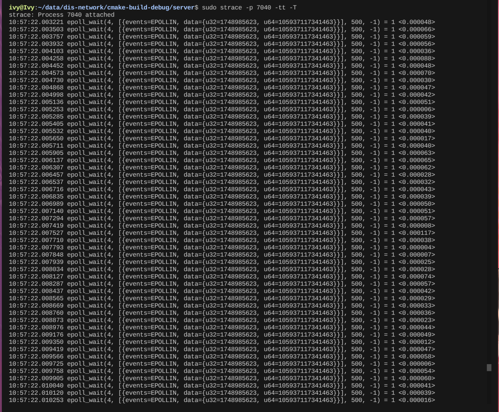

发现epoll_wait一直有一个事件

使用perf查看大量CPU都花在哪条路径上

```shell
sudo perf record -g -t 7040 -- sleep 10
sudo perf report
```

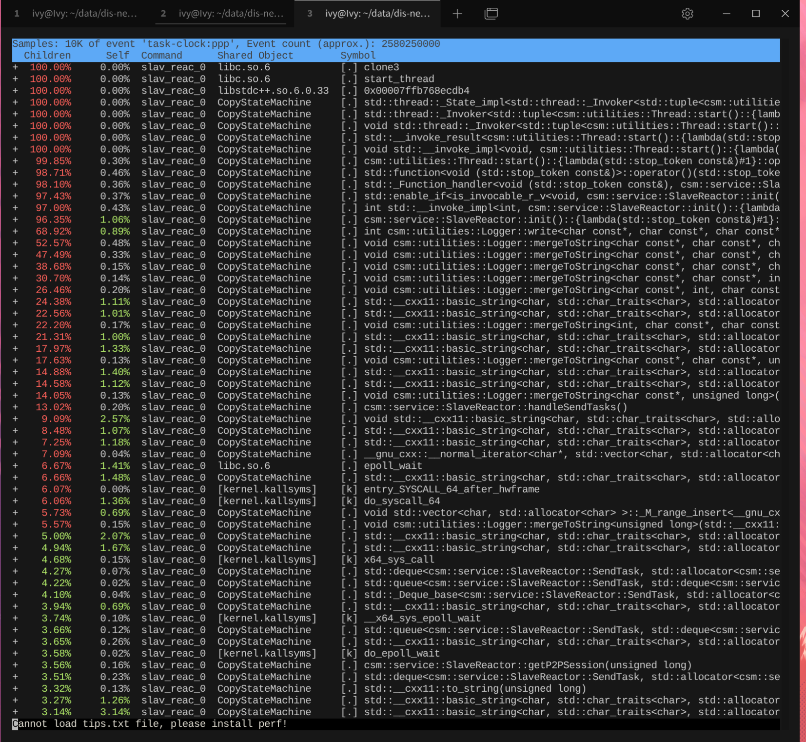

根据结果分析：

epoll_wait被高频唤醒，然后调用handleSendTasks，在handleSendTasks中疯狂写日志

分析代码：

handleSendTasks负责处理发送事件，m_sendTaskWakeupFd负责唤醒它

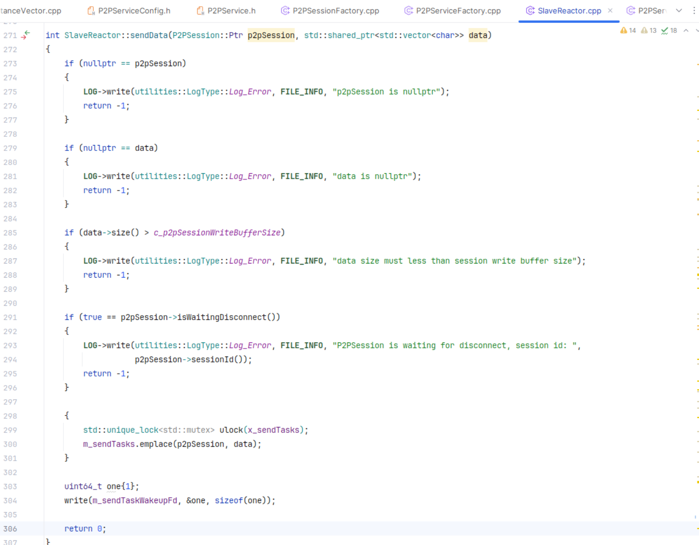

但是m_sendTaskWeakupFd write却没有read

在handleSendTasks()中添加以下代码：

```c++
    uint64_t value;
    read(m_sendTaskWakeupFd, &value, sizeof(value));
```

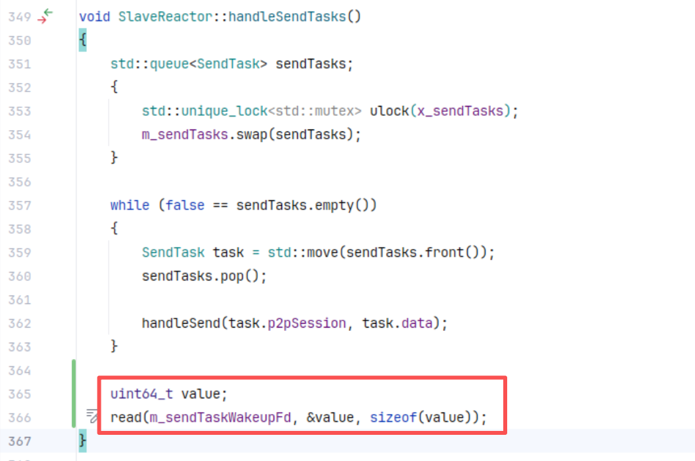

查看日志看一直在输出什么：

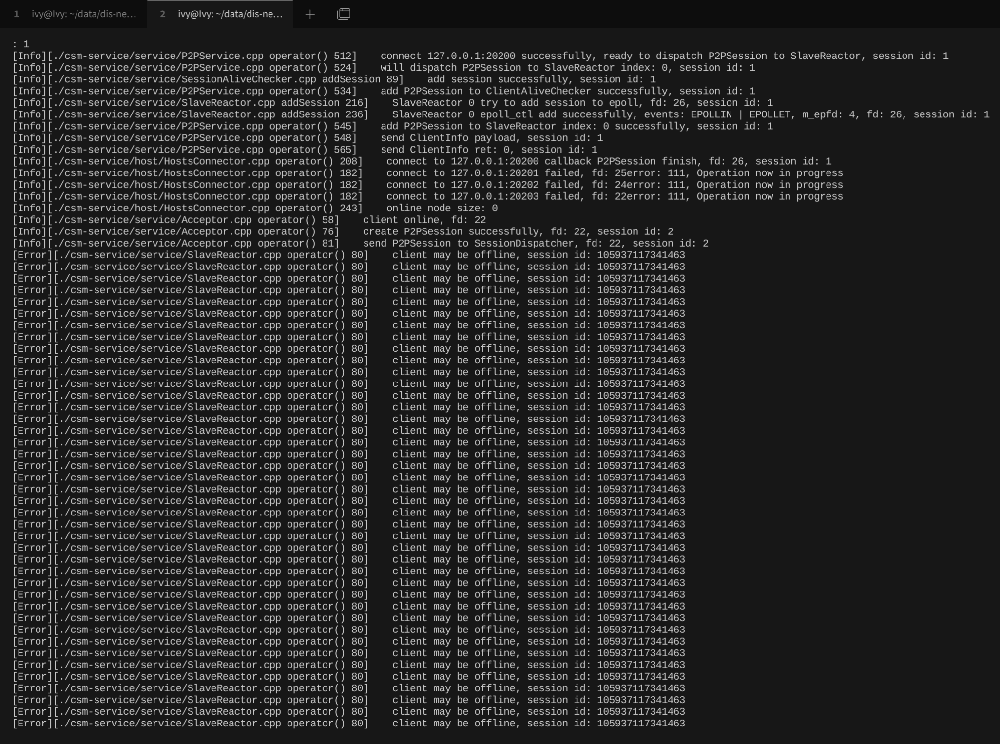

搜索源码

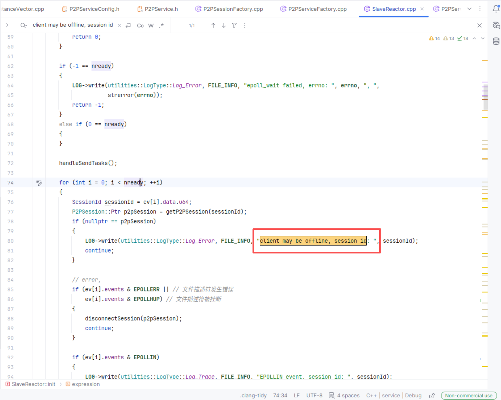

原来是m_sendTaskWeakupFd在读写的时候没有过滤掉，因为它不是连接套接字

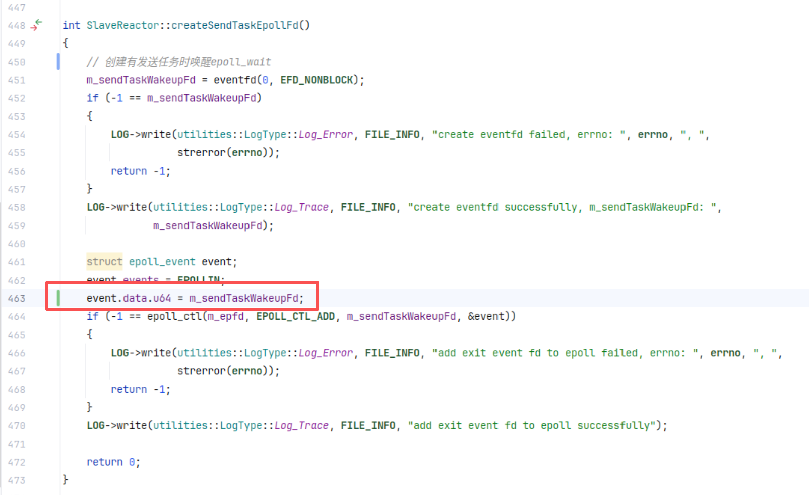

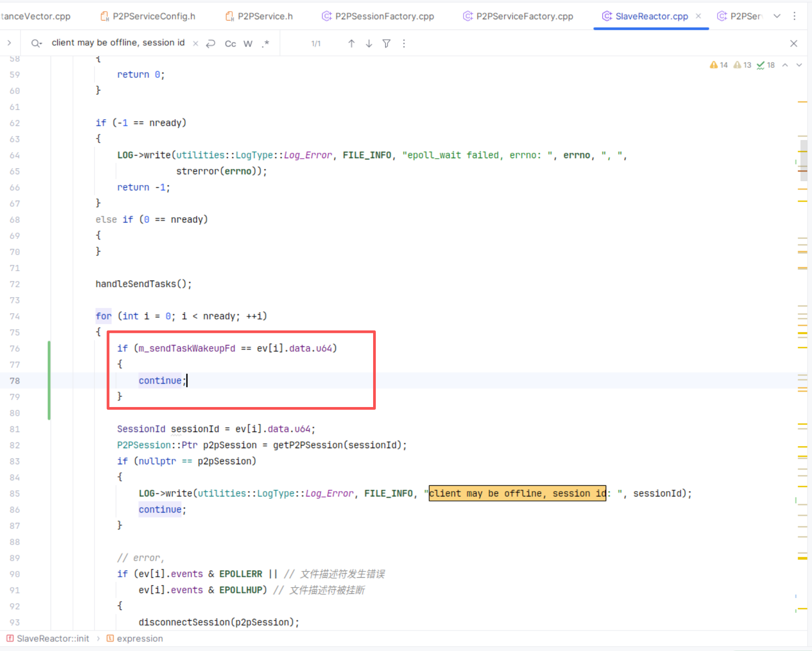

修改后验证：

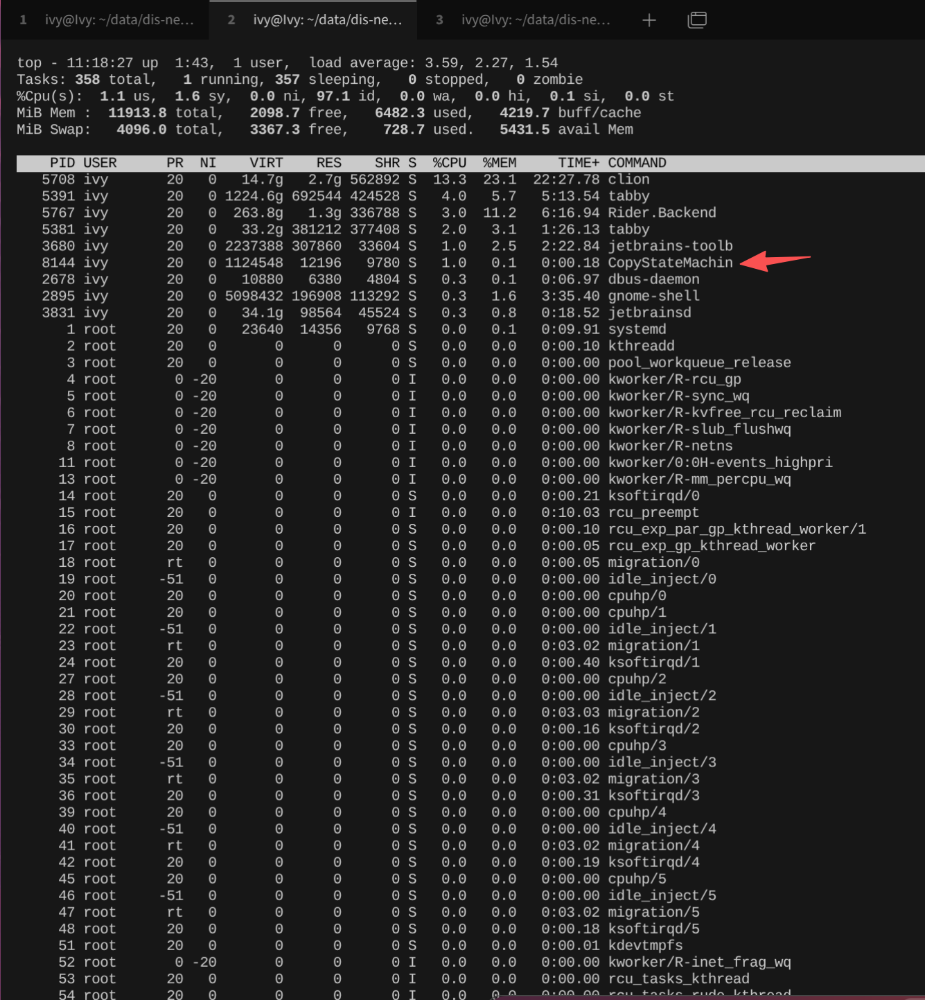